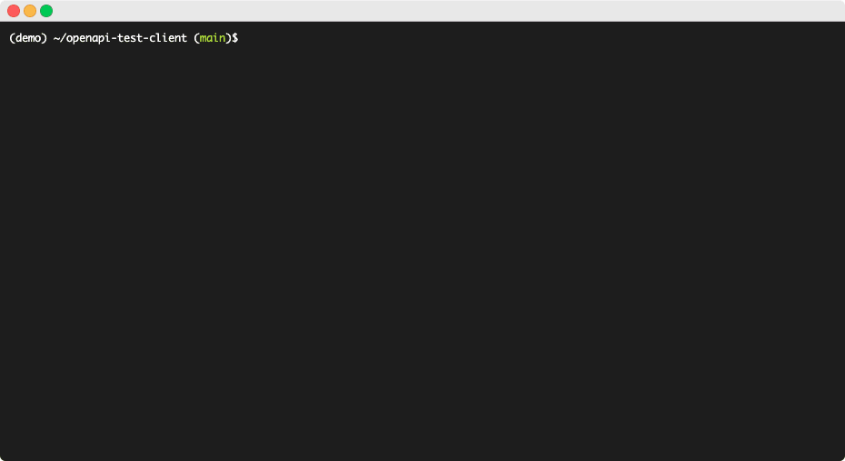
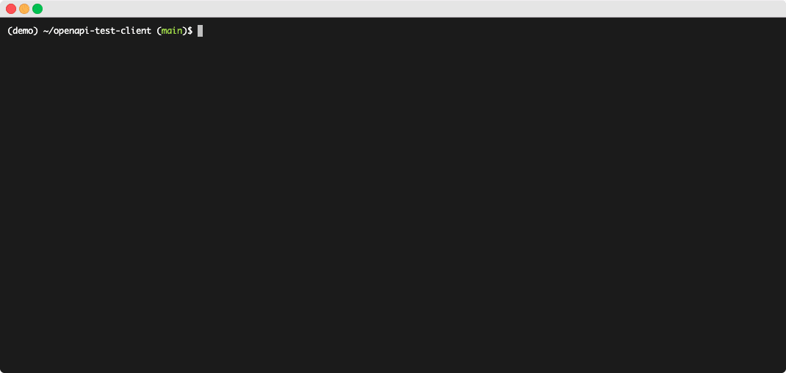

OpenAPI Test Client
======================
[](https://github.com/yugokato/openapi-test-client/actions/workflows/test.yml)
[](https://results.pre-commit.ci/latest/github/yugokato/openapi-test-client/main)
[](https://github.com/psf/black)

# Overview

OpenAPI Test Client (with an emphasis on "test" client) can generate/update API clients in Python from any 
OpenAPI 3.x specifications.  

The goal of the project is to provide easy-to-use/maintain auto-generated API clients for QA engineers who need to 
thoroughly perform automated API testing against API-first applications in a fast-paced development environment. 

During each software release cycle, QA will need to perform various testing to ensure that new APIs to be released work 
as expected. The testing tool for QA requires to have a lot of flexibility and intelligence to achieve this efficiently, 
and to fully automate everything which of course includes negative cases and some unusual scenarios.
This API test client will make the entire testing process very easy and efficient by automatically handling a lot of 
boilerplate under the hood, while also providing you with full control over how and what you want to test, as well as 
how you want to extend or customize it for your own use case.


# SDK client v.s. Test client

One important thing to clarify is that this is NOT an SDK client but a "test" client although both may share some 
common capabilities. An SDK client utilizes stable APIs under the hood for development purposes, while an API test 
client is designed for testing raw APIs that are currently in development and may still contain bugs. What this means 
is the test client will NOT automatically validate requests and responses for you. It is the QA's main responsibility to 
work on, and the test client will provide everything needed for testing APIs. 

> [!TIP]
> If you would like to expand the client's use case beyond testing, you can optionally enable "validation mode" to make 
> it partially behave like an SDK. When validation mode is enabled, your request payload will be validated in 
> Pydantic strict mode on the client side.  
> Please note that validation against response is not currently supported.


# Try it out

## 1. Setup

> [!Important]
> Before moving forward, please make sure to create a new `venv` (requires Python 3.11+) and start with a fresh 
> environment. We will use `pip install` to simplify the setup process, but this project is not intended to be used as 
> a publicly available Python package. Since all dependencies are intentionally pinned strictly to exact versions, 
> dependency conflicts may occur if the installation is done within your existing project. 

```
pip install git+https://github.com/yugokato/openapi-test-client.git
```

Or, if you want to try the demo client with the demo backend app:  
```
pip install "openapi-test-client[app] @ git+https://github.com/yugokato/openapi-test-client.git"
```
Alternatively, you can clone the repo and run `pip install -e .` (or `pip install -e .[app]`) if you prefer to reuse 
this project as your base project. 


## 2. Generate/Update API client code

Once the setup is complete, the `openapi-client` CLI command should be available for generating and updating an API 
client from an OpenAPI spec file. It will take either `generate` or `update` as the first argument. Available command 
options will change based on which action you choose. (see help of each action with `-h` for more details)

```shell
$ openapi-client -h
usage: openapi-client [-h] {generate,update} ...

positional arguments:
  {generate,update}  Action to take
    generate         Generate a new API client from an OpenAPI spec URL
    update           Update an existing API client

options:
  -h, --help         show this help message and exit

```

### Generate a new API client

You can generate a new API client from OpenAPI specs by running the `generate` command:
```
openapi-client generate -u <url> -a <app_name> [--dir <directory>]
```
`url`: The URL of the OpenAPI spec file (JSON/YAML, must be version 3.x) from which you want to generate the API client  
`app_name`: The name of the target application. The value will be used for generating the client name  
`directory`: A directory path to save the generated client modules. The specified directory will become the top-level 
module for accessing all your clients. (This is optional if your project was cloned from the original repository)



To generate another client for a different app, simply run the same command with the same `--dir` value, but with new 
`-u` and `-a` values. 

> [!NOTE]
> The following manual step(s) will be needed after generating a client
> - For each auto-generated API function, rename the function name to whatever value you like. All functions will be generated as "*\_unnamed_endpoint\_{idx}*" by default
> - (If needed) Adjust the value of the API base URL in the `cfg/urls.json`, and the `doc` value in the generated API client's `__init__()` code. These values will be automatically added during the client generation based on the `url` value you specify, but your application may expect to split the URL differently


### Update the existing API client

You can update the existing client code by running the `update` command to reflect the latest OpenAPI specs: 

```
openapi-client update -c <client_name>
```
`client_name`: The name of the client assigned at the client generation step



This update functionality primarily focuses on reflecting the latest OpenAPI specs. It will only touch the following areas: 
- Existing API class tag
- Existing API class functions (signatures and docstrings)
- Existing API parameter models
- Currently missing API functions and parameter models (a new function will be added as "*\_unnamed_endpoint_{idx}*")
- Currently missing API classes (this requires `-A` option)

Anything else, (eg. API class/function names, function body, decorators applied on API functions, etc.) will remain 
intact so that updated client code won't break your existing test code.

> [!TIP]
> - You might want to run the command with `-d`/`--dry-run` option first to see changes before actually updating code
> - You can limit the scope of the update (eg. specific tag, specific endpoint, etc.) by using various command options. 
> See more details with `-h`

    
## 3. Use the API client

Your client should be ready to use by now. For demonstration purposes, the rest of the sections will be explained using 
the [DemoAppAPIClient](src/openapi_test_client/clients/demo_app) that comes with this repository as an example client. This demo client was actually 
generated by the following `openapi-client generate` command against the Quart-based [demo app](src/demo_app) 
demo application:
```
openapi-client generate -u http://127.0.0.1:5000/openapi.json -a demo_app
``` 
It was also manually extended with a custom [post-request hook](src/openapi_test_client/clients/demo_app/api/request_hooks/post_request.py) for automatically managing auth tokens 
before login and after logout.

> [!NOTE]
> If you would like to try this `demo_app` API client by yourself, follow the following steps to start the demo application before moving forward:
> 1. Clone the repo
> 2. Set up with `app` server-side extra dependency  (see the "Setup" section)
> 3. Start the application with `QUART_APP=demo_app.main:app quart run` command
> ```shell
> $ QUART_APP=demo_app.main:app quart run
> * Serving Quart app 'demo_app'
> * Debug mode: False
> * Please use an ASGI server (e.g. Hypercorn) directly in production
> * Running on http://127.0.0.1:5000 (CTRL + C to quit)
>[2024-01-01 00:00:00 -0000] [39691] [INFO] Running on http://127.0.0.1:5000 (CTRL + C to quit)
> ```


### Instantiate the client

Once you have generated an API client, the client class will be importable as 
`from <your_module>.clients.<client_name> import <ClientName>APIClient`. 

```pycon
>>> from openapi_test_client.clients.demo_app import DemoAppAPIClient
>>> client = DemoAppAPIClient()
```
Make sure to replace the "openapi_test_client" part with your own module name when importing your own clients.

Alternatively, you can instantiate your client directly from the parent `OpenAPIClient` class.

```pycon
>>> from openapi_test_client.clients import OpenAPIClient
>>> client = OpenAPIClient.get_client("<client_name>")
```

### Make an API request

To make an API request with your API client, call an API function as  `client.<API_TAG>.<api_function_name>()`. 
The function will take all parameters documented in the OpenAPI specs as keyword arguments. 

eg. To call the login API defined under the Auth tag:
```pycon
>>> r = client.AUTH.login(username='foo', password='bar')
2024-01-01T00:00:00.863-0800 - request: POST http://127.0.0.1:5000/v1/auth/login
2024-01-01T00:00:00.877-0800 - response: 201 (Created)
- request_id: a2b20acf-22d5-4131-ac0d-6796bf19d2af
- request: POST http://127.0.0.1:5000/v1/auth/login
- payload: {"username": "foo", "password": "***"}
- status_code: 201 (Created)
- response: {
    "token": "IjFlNTAxNmI2LTVlZjctNGQxYi1iMGJhLTYxY2M3ZWIzY2VmYSI.ZadDlA.tKS_La5uDuteXH7OMT_WZVK1o_hAnWZVn_J5rSsJQILHu1juXYg0EYLkgpH1LChzeOhN_YUUXaO37rlt_UV1Ag"
}
- response_time: 0.01344s
```

> [!NOTE] 
> - A new UUID will be generated at each request and will be set to the `X-Request-ID` header
> - `DemoAppAPIClient` will automatically set the `token` value to the API session in the client's post-request logic mentioned earlier

The function call will return a `RestResponse` object where the decoded response is accessible as `response`. If you 
need to access the raw request and response objects from the `requests` library, you can do so through the `request` 
and `_response` attributes.

```pycon
>>> r.status_code
201
>>> r.response
{'token': 'IjFlNTAxNmI2LTVlZjctNGQxYi1iMGJhLTYxY2M3ZWIzY2VmYSI.ZadDlA.tKS_La5uDuteXH7OMT_WZVK1o_hAnWZVn_J5rSsJQILHu1juXYg0EYLkgpH1LChzeOhN_YUUXaO37rlt_UV1Ag'}
>>> pprint(r)
RestResponse(_response=<Response [201],
             request_id='a2b20acf-22d5-4131-ac0d-6796bf19d2af',
             status_code=201,
             response={'token': 'IjFlNTAxNmI2LTVlZjctNGQxYi1iMGJhLTYxY2M3ZWIzY2VmYSI.ZadDlA.tKS_La5uDuteXH7OMT_WZVK1o_hAnWZVn_J5rSsJQILHu1juXYg0EYLkgpH1LChzeOhN_YUUXaO37rlt_UV1Ag'},
             response_time=0.01344,
             request=<PreparedRequest [POST]>,
             ok=True,
             is_stream=False)
```
Note that we extend the `requests` library's `PreparedRequest` and `Session` classes to add a few small 
capabilities. 
As an example, you can get the request start/end time (UTC) through `request` as a `datatime` object.
 
```pycon
>>> r.request.start_time
datetime.datetime(2024, 1, 1, 0, 0, 0, 86309, tzinfo=datetime.timezone.utc)
>>> r.request.end_time
datetime.datetime(2024, 1, 1, 0, 0, 0, 87714, tzinfo=datetime.timezone.utc)
```

## 4. Customize API functions (optional)

The test client provides a few ways to customize how an API call via an API function will be processed.

### Implement your custom function logic
By default, each auto-generated API function will look like a stub function with a placeholder (`...`). For example:
```python
@endpoint.is_public
@endpoint.post("/v1/auth/login")
def login(self, *, username: str = Unset, password: str = Unset, **kwargs) -> RestResponse:
    """Login"""
    ...
```

Even without having actual function logic, API requests made through these functions will just work - The function call will automatically make an HTTP request to the associated endpoint with the provided parameters, parse the response, and return it as a `RestResponse` object. This behavior is managed by the `@endpoint.<method>(path>)` decorator.  
In most cases, you won’t need to modify the generated function body at all.

However, if you need to implement custom logic for making an API request for specific API functions, you can replace the placeholder with your own code. Just ensure that the function returns a `RestResponse` object, which is what the underlying Rest API client we use will return.

> [!NOTE]
> The client will raise a `RuntimeError` if anything other than a `RestResponse` object or `None` is returned.

> [!TIP]
> If you only need to add extra behavior before or after the request, consider using decorators or request hooks instead

### Decorators
To extend the default API call logic, you can apply decorators on an API function. Note that each decorator MUST be decorated with `@endpoint.decorator` for it to work properly.  

For example:
- Define a decorator
```python
from functools import wraps

from openapi_test_client.libraries.api import endpoint

@endpoint.decorator
def my_decorator(f):
    @wraps(f)
    def wrapper(*args, **kwargs):
        # Do something before request
        response = f(**args, **kwargs)
        # Do something after request
        return response
    return wrapper
```

- Apply it

```python
@my_decorator
@endpoint.is_public
@endpoint.post("/v1/auth/login")
def login(self, *, username: str = Unset, password: str = Unset, **kwargs) -> RestResponse:
    """Login"""
    ...
```

### Request Hooks

The test client supports three types of request hooks in API classes:
- Pre-request Hook: Called before an API request is made
- Post-request Hook: Called after an API request is completed
- Request wrapper: Wraps the original API request logic before any decorators are applied, allowing you to apply additional behavior before and after a request

Hooks work similarly to decorators but are more useful for applying general control that affects multiple or all endpoints at the central place.

For examples and usage, see [demo_app client hooks](src/openapi_test_client/clients/demo_app/api/request_hooks)


# Deep Dive 

The following are some of the important building blocks of the API test client:
- API client
- API class and functions
- API endpoint function
- API endpoint model
- API parameter model
- Pydantic model (validation mode)


## API client

All API clients will inherit the base client `OpenAPIClient`, which will handle parsing OpenAPI specs and resolving 
`$ref`. The generated API client will have a `@cached_property` definition for each API tag (or set of tags when 
managing APIs in multiple tags), where an API class instance will be returned. 

```python
# openapi_test_client/clients/demo_app/demo_app_client.py

from functools import cached_property

from openapi_test_client.clients.base import OpenAPIClient

from .api.auth import AuthAPI
from .api.users import UsersAPI


class DemoAppAPIClient(OpenAPIClient):
    """API client for demo_app"""

    def __init__(self, env: str = "dev"):
        super().__init__("demo_app", env=env, doc="openapi.json")

    @cached_property
    def AUTH(self):
        return AuthAPI(self)

    @cached_property
    def USERS(self):
        return UsersAPI(self)
```


## API class and functions

All API endpoints for a tag (or set of tags) will be managed inside an "API class", where each function will map to a 
specific endpoint documented in the OpenAPI spec. 

For example, if the OpenAPI spec defines Auth APIs like this: 
```json
"paths": {
    "/v1/auth/login": {
      "post": {
        "parameters": [],
        "responses": {},
        "description": "",
        "summary": "Login",
        "tags": [
          "Auth"
        ],
        "security":[],
        "requestBody": {
          "content": {
            "application/json": {
              "schema": {
                "properties": {
                  "username": {
                    "title": "Username",
                    "type": "string"
                  },
                  "password": {
                    "title": "Password",
                    "type": "string"
                  }
                },
                "required": [
                  "username",
                  "password"
                ],
                "title": "LoginData",
                "type": "object"
              }
            }
          }
        },
        "operationId": "post_login"
      }
    },
    "/v1/auth/logout": {
      "get": {
        "parameters": [],
        "responses": {},
        "description": "",
        "summary": "Logout",
        "tags": [
          "Auth"
        ],
        "security":[],
        "operationId": "get_logout"
      }
    },
```

Then the API class and functions will be generated like this:

```python
# openapi_test_client/clients/demo_app/api/auth.py

from common_libs.clients.rest_client import RestResponse

from openapi_test_client.clients.demo_app.api.base import DemoAppBaseAPI
from openapi_test_client.libraries.api.api_functions import endpoint
from openapi_test_client.libraries.api.types import Unset


class AuthAPI(DemoAppBaseAPI):
    TAGs = ("Auth",)

    @endpoint.is_public
    @endpoint.post("/v1/auth/login")
    def login(self, *, username: str = Unset, password: str = Unset, **kwargs) -> RestResponse:
        """Login"""
        ...

    @endpoint.is_public
    @endpoint.get("/v1/auth/logout")
    def logout(self, **kwargs) -> RestResponse:
        """Logout"""
        ...

```
A function can take API path parameters and query/body parameters as arguments, where path parameters are always 
defined as positional-only arguments, and other parameters are always defined as keyword-only arguments with a default 
value of `Unset`. Any parameters with this sentinel value will be excluded from the actual API call parameters.   
Additionally, it will always have `**kwargs` for supporting making a call with any undocumented 
parameters and/or with raw `requests` library options (eg. `timeout`, `headers`, etc) if you need to. 

> [!NOTE]
> Parameters defined as optional in the OpenAPI spec will be annotated with `Optional[]` in the function signature, but 
> this does not mean the parameter is actually optional for the endpoint. It just means you can hit the endpoint 
> without specifying that parameter, whether it is actually required or not (for negative case testing)

Some attributes available from the API class: 
```pycon
>>> # Get tag data
>>> client.AUTH.TAGs
('Auth',)
>>> # Get available endpoints under this API class 
>>> pprint(client.AUTH.endpoints)
[Endpoint(tags=('Auth',),
          api_class=<class 'openapi_test_client.clients.demo_app.api.auth.AuthAPI'>,
          method='post',
          path='/v1/auth/login',
          func_name='login',
          model=<class 'types.AuthAPILoginEndpointModel'>,
          url=None,
          content_type=None,
          is_public=True,
          is_documented=True,
          is_deprecated=False),
 Endpoint(tags=('Auth',),
          api_class=<class 'openapi_test_client.clients.demo_app.api.auth.AuthAPI'>,
          method='get',
          path='/v1/auth/logout',
          func_name='logout',
          model=<class 'types.AuthAPILogoutEndpointModel'>,
          url=None,
          content_type=None,
          is_public=True,
          is_documented=True,
          is_deprecated=False)]
```

A list of defined API classes are available as `API_CLASSES`.
```pycon
>>> from itertools import chain
>>> from openapi_test_client.clients.demo_app.api import API_CLASSES
# list all andpoints
>>> all_endpoints = chain(*[x.endpoints for x in API_CLASSES])
>>> for endpoint in all_endpoints:
...     print(endpint)
... 
POST /v1/auth/login
GET /v1/auth/logout
POST /v1/users
GET /v1/users/{user_id}
GET /v1/users
POST /v1/users/images
DELETE /v1/users/{user_id}
```


## API endpoint function

Each API class function is decorated with a `@endpoint.<method>(<path>)` endpoint decorator. This decorator converts the original function into an instance of the `EndpointHandler` class at runtime. The `EndpointHandler` object acts as a proxy to a per-endpoint `EndpointFunc` object, which is also created at runtime and is responsible for handling the actual API calls via its base class's `__call__()` method. Additionally, the `EndpointFunc` object provides various capabilities and attributes related to the endpoint.

eg. The Login API is accessible via `client.AUTH.login()` API function, which is actually an instance of 
`AuthAPILoginEndpointFunc` class returned by its associated `EndpointHandler` obj.

```pycon
>>> client.AUTH.login
<openapi_test_client.libraries.api.api_functions.endpoint.AuthAPILoginEndpointFunc object at 0x1074abf10>
(mapped to: <function AuthAPI.login at 0x10751c360>)
```

The endpoint function is also accessible directly from the API class:
```pycon
>>> from openapi_test_client.clients.demo_app.api.auth import AuthAPI
>>> AuthAPI.login
<openapi_test_client.libraries.api.api_functions.endpoint.AuthAPILoginEndpointFunc object at 0x107650b50>
(mapped to: <function AuthAPI.login at 0x10751c360>)
```

Various endpoint data is available from the endpoint function via `endpoint` property:
```pycon
>>> print(client.AUTH.login.endpoint)
POST /v1/auth/login
>>> pprint(client.AUTH.login.endpoint)
Endpoint(tags=('Auth',),
         api_class=<class 'openapi_test_client.clients.demo_app.api.auth.AuthAPI'>,
         method='post',
         path='/v1/auth/login',
         func_name='login',
         model=<class 'types.AuthAPILoginEndpointModel'>,
         url='http://127.0.0.1:5000/v1/auth/login',
         content_type=None,
         is_public=True,
         is_documented=True,
         is_deprecated=False)
>>> client.AUTH.login.endpoint.method
'post'
>>> client.AUTH.login.endpoint.path
'/v1/auth/login'
>>> client.AUTH.login.endpoint.url
'http://127.0.0.1:5000/v1/auth/login'
```

Note that the same endpoint data is also available directly from the API class, except for `url` will always be `None`.
```pycon
>>> from openapi_test_client.clients.demo_app.api.auth import AuthAPI
>>> client.AUTH.login.endpoint == AuthAPI.login.endpoint
True
>>> print(AuthAPI.login.endpoint)
POST /v1/auth/login
>>> pprint(AuthAPI.login.endpoint)
Endpoint(tags=('Auth',),
         api_class=<class 'openapi_test_client.clients.demo_app.api.auth.AuthAPI'>,
         method='post',
         path='/v1/auth/login',
         func_name='login',
         model=<class 'types.AuthAPILoginEndpointModel'>,
         url=None,
         content_type=None,
         is_public=True,
         is_documented=True,
         is_deprecated=False)
```

An example of the additional capability the `EndpointFunc` obj provides - Automatic retry:
```pycon
# Call the endpiont with the automatic retry (you can specify a retry condition if needed)
>>> r = client.AUTH.login.with_retry(username='foo', password='bar')
2024-01-01T00:00:00.153-0000 - request: POST http://127.0.0.1:5000/v1/auth/login
2024-01-01T00:00:00.158-0000 - response: 429 (Too Many Requests)
- request_id: 1b028ff7-0880-430c-b5a3-12aa057892cf
- request: POST http://127.0.0.1:5000/v1/auth/login
- payload: {"username": "foo", "password": "***"}
- status_code: 429 (Too Many Requests)
{
    "error": "Too many requests"
}
- response_time: 0.004804s
2024-01-01T00:00:00.159-0000 - Retry condition matched. Retrying in 5 seconds...
2024-01-01T00:00:05.166-0000 - request: POST http://127.0.0.1:5000/v1/auth/login
2024-01-01T00:00:05.171-0000 - response: 201 (Created)
- request_id: 1a34195e-5cec-4d4e-abe0-61acbfcdae1a
- request: POST http://127.0.0.1:5000/v1/auth/login
- payload: {"username": "foo", "password": "***"}
- status_code: 201 (Created)
- response: {
    "token": "ImJjMjA5YjkxLTEzYmItNDE3Yi1iN2ExLTdhNmFlNWFjYjFiNSI.ZuSs3Q.KD-zA6KxCUEC14YUAuCcuQNGNoulp2POuKq0yMIfkGIS0E--V473kssohnvGoIHo97FwwSeOV94NnwaZdGtSxA"
}
- response_time: 0.005143s
>>> 
>>> r.request.retried.request_id
'1b028ff7-0880-430c-b5a3-12aa057892cf'
```


## API endpoint model

Each endpoint is represented as an `EndpointModel` dataclass model, which holds various context around each 
parameter (eg. type annotation).
```pycon
>>> model = client.AUTH.login.endpoint.model
>>> print(model)
<class 'types.AuthAPILoginEndpointModel'>
>>> pprint(model.__dataclass_fields__, sort_dicts=False)
{'username': Field(name='username',type=<class 'str'>,default=<object object at 0x107b410b0>,default_factory=<dataclasses._MISSING_TYPE object at 0x107ea61d0>,init=True,repr=True,hash=None,compare=True,metadata=mappingproxy({}),kw_only=True,_field_type=_FIELD),
 'password': Field(name='password',type=<class 'str'>,default=<object object at 0x107b410b0>,default_factory=<dataclasses._MISSING_TYPE object at 0x107ea61d0>,init=True,repr=True,hash=None,compare=True,metadata=mappingproxy({}),kw_only=True,_field_type=_FIELD)}
```

## API parameter model

If a parameter type is documented as `object` (or `array` of objects) with `properties` in the OpenAPI specs, it will 
be represented as a `ParamModel` dataclass model. These models will be automatically generated as a model file (`<your_module_dir>/clients/<client_name>/models/<api_tag>.py`) for each API class.

eg. 

- API function definition (note that the `metadata` parameter is of type `Metadata`)
```python
# openapi_test_client/clients/demo_app/api/users.py

from typing import Annotated, Literal

from common_libs.clients.rest_client import RestResponse

from openapi_test_client.clients.demo_app.api.base import DemoAppBaseAPI
from openapi_test_client.libraries.api.api_functions import endpoint
from openapi_test_client.libraries.api.types import Constraint, Format, Optional, Unset

from ..models.users import Metadata


class UsersAPI(DemoAppBaseAPI):
    TAGs = ("Users",)

    @endpoint.post("/v1/users")
    def create_user(
        self,
        *,
        first_name: Annotated[str, Constraint(min_len=1, max_len=255)] = Unset,
        last_name: Annotated[str, Constraint(min_len=1, max_len=255)] = Unset,
        email: Annotated[str, Format("email")] = Unset,
        role: Literal["admin", "viewer", "support"] = Unset,
        metadata: Optional[Metadata] = Unset,
        **kwargs,
    ) -> RestResponse:
        """Create a new user"""
        ...
```

- Parameter model definition
```python
# openapi_test_client/clients/demo_app/models/users.py

from dataclasses import dataclass
from typing import Annotated, Literal

from openapi_test_client.libraries.api.types import Constraint, Format, Optional, ParamModel, Unset


@dataclass
class Preferences(ParamModel):
    theme: Optional[Literal["light", "dark", "system"]] = Unset
    language: Optional[str] = Unset
    font_size: Optional[Annotated[int, Constraint(min=8, max=40, multiple_of=2)]] = Unset


@dataclass
class SocialLinks(ParamModel):
    facebook: Optional[Annotated[str, Format("uri"), Constraint(min_len=1)]] = Unset
    instagram: Optional[Annotated[str, Format("uri"), Constraint(min_len=1)]] = Unset
    linkedin: Optional[Annotated[str, Format("uri"), Constraint(min_len=1)]] = Unset
    github: Optional[Annotated[str, Format("uri"), Constraint(min_len=1)]] = Unset


@dataclass
class Metadata(ParamModel):
    preferences: Optional[Preferences] = Unset
    social_links: Optional[SocialLinks] = Unset

```

> [!NOTE]
> Same like API function parameters:
> - All model attributes will be defined with a default value of `Unset`. Any parameters with this sentinel value will be excluded from an API call payload
> - Parameters defined as optional in the OpenAPI spec will be annotated with `Optional[]` in the model definition

A parameter model is a customized `dataclass` that is intended to function exactly the same as a dictionary under the hood. 
Unlike the native dataclass, a parameter model instance will only hold fields that were explicitly given at instantiation. 
This is very important when you want to differentiate test scenarios for "not including a parameter in the payload" v.s. 
"explicitly giving a `null` value for a parameter".

```pycon
>>> from dataclasses import asdict, is_dataclass
>>> from openapi_test_client.clients.demo_app.models.users import *
>>> metadata = Metadata(preferences=Preferences(theme='dark'))
>>> print(metadata)
Metadata(preferences=Preferences(theme='dark'))
>>> print(metadata.preferences)
Preferences(theme='dark')
>>> print(metadata["preferences"])
Preferences(theme='dark')
>>> is_dataclass(metadata) and isinstance(metadata, dict)
True
>>> metadata.items()
dict_items([('preferences', Preferences(theme='dark'))])
>>> asdict(metadata)
{'preferences': {'theme': 'dark'}}
```

Parameter models function both as a dataclass and a dictionary, and a change made to one will be reflected in the other.
```pycon
>>> # Update a model field value
>>> metadata.preferences.theme = "light"
>>> print(metadata)
Metadata(preferences=Preferences(theme='light'))
>>> asdict(metadata)
{'preferences': {'theme': 'light'}}
>>>
>>> # Update as a dictionary
>>> metadata.preferences["theme"] = "dark"
>>> print(metadata)
Metadata(preferences=Preferences(theme='dark'))
>>> asdict(metadata)
{'preferences': {'theme': 'dark'}}
```

You can also dynamically add or delete model fields similar to how you can add or remove a key from a dictionary, if you need to.
```pycon
>>> # Add a new field to the model
>>> metadata.new_attr1 = 123
>>> print(metadata)
Metadata(preferences=Preferences(theme='dark'), new_attr1=123)
>>> asdict(metadata)
{'preferences': {'theme': 'dark'}, 'new_attr1': 123}
>>> 
>>> # Add a new field to the dictionary
>>> metadata["new_attr2"] = 456
>>> print(metadata)
Metadata(preferences=Preferences(theme='dark'), new_attr1=123, new_attr2=456)
>>> asdict(metadata)
{'preferences': {'theme': 'dark'}, 'new_attr1': 123, 'new_attr2': 456}
>>>
>>> # Delete a field from the model
>>> delattr(metadata, "new_attr2")
>>> print(metadata)
Metadata(preferences=Preferences(theme='dark'), new_attr1=123)
>>> asdict(metadata)
{'preferences': {'theme': 'dark'}, 'new_attr1': 123}
>>>
>>> # Delete a field from the dictionary
>>> del metadata["new_attr1"]
>>> print(metadata)
Metadata(preferences=Preferences(theme='dark'))
>>> asdict(metadata)
{'preferences': {'theme': 'dark'}}
```

## Pydantic models (Validation mode)

By default, our client models will not perform any validation for you, since they are based on `dataclass`. This allows 
the test client to send whatever invalid values for a parameter to verify the server-side validation logic.    
To expand the use case of the client beyond testing, you can optionally enable "validation mode". When enabled, all of 
our dataclass models (Endpoint/Param models) will be automatically converted into native Pydantic models that inherit 
this custom base model class:

```python
from typing import ClassVar

from pydantic import BaseModel, ConfigDict


class PydanticModel(BaseModel):
    """Base class for Pydantic endpoint/param models"""

    model_config: ClassVar = ConfigDict(extra="forbid", validate_assignment=True, strict=True)
```

With this dynamic conversion, request parameters will be automatically validated in Pydantic strict mode before an API 
request call.  

Here are some comparisons between regular models and pydantic models:

- Regular dataclass model (Validation will be done on the server-side)
```pycon 
>>> # Model definition
>>> model = client.USERS.create_user.endpoint.model
>>> print(model)
<class 'types.UsersAPICreateUserEndpointModel'>
>>> pprint(model.__dataclass_fields__, sort_dicts=False)
{'first_name': Field(name='first_name',type=typing.Annotated[str, Constraint(min=None, max=None, multiple_of=None, min_len=1, max_len=255, nullable=None, pattern=None, exclusive_minimum=None, exclusive_maximum=None)],default=<object object at 0x107b410b0>,default_factory=<dataclasses._MISSING_TYPE object at 0x107ea61d0>,init=True,repr=True,hash=None,compare=True,metadata=mappingproxy({}),kw_only=True,_field_type=_FIELD),
 'last_name': Field(name='last_name',type=typing.Annotated[str, Constraint(min=None, max=None, multiple_of=None, min_len=1, max_len=255, nullable=None, pattern=None, exclusive_minimum=None, exclusive_maximum=None)],default=<object object at 0x107b410b0>,default_factory=<dataclasses._MISSING_TYPE object at 0x107ea61d0>,init=True,repr=True,hash=None,compare=True,metadata=mappingproxy({}),kw_only=True,_field_type=_FIELD),
 'email': Field(name='email',type=typing.Annotated[str, Format(value='email')],default=<object object at 0x107b410b0>,default_factory=<dataclasses._MISSING_TYPE object at 0x107ea61d0>,init=True,repr=True,hash=None,compare=True,metadata=mappingproxy({}),kw_only=True,_field_type=_FIELD),
 'role': Field(name='role',type=typing.Literal['admin', 'viewer', 'support'],default=<object object at 0x107b410b0>,default_factory=<dataclasses._MISSING_TYPE object at 0x107ea61d0>,init=True,repr=True,hash=None,compare=True,metadata=mappingproxy({}),kw_only=True,_field_type=_FIELD),
 'metadata': Field(name='metadata',type=typing.Optional[openapi_test_client.clients.demo_app.models.users.Metadata],default=<object object at 0x107b410b0>,default_factory=<dataclasses._MISSING_TYPE object at 0x107ea61d0>,init=True,repr=True,hash=None,compare=True,metadata=mappingproxy({}),kw_only=True,_field_type=_FIELD)}
>>>
>>> # Make an API request with the invalid parameter values
>>> r = client.USERS.create_user(first_name=123, email="foo", role="something", metadata=Metadata(social_links=SocialLinks(facebook="test")), extra=123)
2024-01-01T00:00:00.741-0800 - The request contains one or more parameters UsersAPI.create_user() does not expect:
- extra
2024-01-01T00:00:00.742-0800 - request: POST http://127.0.0.1:5000/v1/users
2024-01-01T00:00:00.752-0800 - response: 400 (Bad Request)
- request_id: 91b4ac05-1280-473b-ac41-0be30903c448
- request: POST http://127.0.0.1:5000/v1/users
- payload: {"first_name": 123, "email": "foo", "role": "something", "metadata": {"social_links": {"facebook": "test"}}, "extra": 123}
- status_code: 400 (Bad Request)
- response: {
    "error": {
        "code": 400,
        "message": [
            {
                "type": "string_type",
                "loc": [
                    "first_name"
                ],
                "msg": "Input should be a valid string",
                "input": 123,
                "url": "https://errors.pydantic.dev/2.6/v/string_type"
            },
            {
                "type": "missing",
                "loc": [
                    "last_name"
                ],
                "msg": "Field required",
                "input": {
                    "first_name": 123,
                    "email": "foo",
                    "role": "something",
                    "metadata": {
                        "social_links": {
                            "facebook": "test"
                        }
                    },
                    "extra": 123
                },
                "url": "https://errors.pydantic.dev/2.6/v/missing"
            },
            {
                "type": "value_error",
                "loc": [
                    "email"
                ],
                "msg": "value is not a valid email address: The email address is not valid. It must have exactly one @-sign.",
                "input": "foo",
                "ctx": {
                    "reason": "The email address is not valid. It must have exactly one @-sign."
                },
                "url": "https://errors.pydantic.dev/2.6/v/value_error"
            },
            {
                "type": "enum",
                "loc": [
                    "role"
                ],
                "msg": "Input should be 'admin', 'viewer' or 'support'",
                "input": "something",
                "ctx": {
                    "expected": "'admin', 'viewer' or 'support'"
                },
                "url": "https://errors.pydantic.dev/2.6/v/enum"
            },
            {
                "type": "url_parsing",
                "loc": [
                    "metadata",
                    "social_links",
                    "facebook"
                ],
                "msg": "Input should be a valid URL, relative URL without a base",
                "input": "test",
                "ctx": {
                    "error": "relative URL without a base"
                },
                "url": "https://errors.pydantic.dev/2.6/v/url_parsing"
            }
        ],
        "request_id": "91b4ac05-1280-473b-ac41-0be30903c448"
    }
}
- response_time: 0.010107s
```

- Pydantic model (Validation will be done on the client-side)
```pycon
>>> # Model definition
>>> pydantic_model = client.USERS.create_user.endpoint.model.to_pydantic()
>>> print(pydantic_model)
<class 'types.UsersAPICreateUserEndpointModel'>
>>> pprint(pydantic_model.model_fields, sort_dicts=False)
{'first_name': FieldInfo(annotation=str, required=True, metadata=[MinLen(min_length=1), MaxLen(max_length=255), Constraint(min=None, max=None, multiple_of=None, min_len=1, max_len=255, nullable=None, pattern=None, exclusive_minimum=None, exclusive_maximum=None)]),
 'last_name': FieldInfo(annotation=str, required=True, metadata=[MinLen(min_length=1), MaxLen(max_length=255), Constraint(min=None, max=None, multiple_of=None, min_len=1, max_len=255, nullable=None, pattern=None, exclusive_minimum=None, exclusive_maximum=None)]),
 'email': FieldInfo(annotation=EmailStr, required=True, metadata=[Format(value='email')]),
 'role': FieldInfo(annotation=Literal['admin', 'viewer', 'support'], required=True),
 'metadata': FieldInfo(annotation=Union[Metadata, NoneType], required=False, default=None)}
>>>
>>> # Make an API request with the same invalid parmeter values, but with validate=True option
>>> r = client.USERS.create_user(first_name=123, email="foo", role="something", metadata=Metadata(social_links=SocialLinks(facebook="test")), extra=123, validate=True)
2024-01-01T00:00:00.830-0800 - The request contains one or more parameters UsersAPI.create_user() does not expect:
- extra
Traceback (most recent call last):
  File "<stdin>", line 1, in <module>
    <snip>
    raise ValueError(
ValueError: Request parameter validation failed.
6 validation errors for UsersAPICreateUserEndpointModel
first_name
  Input should be a valid string [type=string_type, input_value=123, input_type=int]
    For further information visit https://errors.pydantic.dev/2.6/v/string_type
last_name
  Field required [type=missing, input_value={'first_name': 123, 'emai... 'test'}}, 'extra': 123}, input_type=dict]
    For further information visit https://errors.pydantic.dev/2.6/v/missing
email
  value is not a valid email address: The email address is not valid. It must have exactly one @-sign. [type=value_error, input_value='foo', input_type=str]
role
  Input should be 'admin', 'viewer' or 'support' [type=literal_error, input_value='something', input_type=str]
    For further information visit https://errors.pydantic.dev/2.6/v/literal_error
metadata.social_links.facebook
  Input should be a valid URL, relative URL without a base [type=url_parsing, input_value='test', input_type=str]
    For further information visit https://errors.pydantic.dev/2.6/v/url_parsing
extra
  Extra inputs are not permitted [type=extra_forbidden, input_value=123, input_type=int]
    For further information visit https://errors.pydantic.dev/2.6/v/extra_forbidden
```

> [!TIP]
> The above example enables validation mode "per request" by passing `validate=True` to the API function call. 
> Alternatively, you can also set `VALIDATION_MODE='true'` environment variable to globally enable the validation mode.
